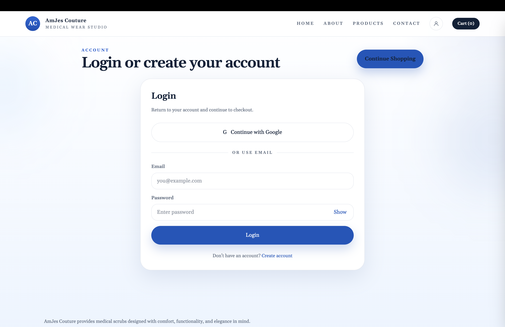
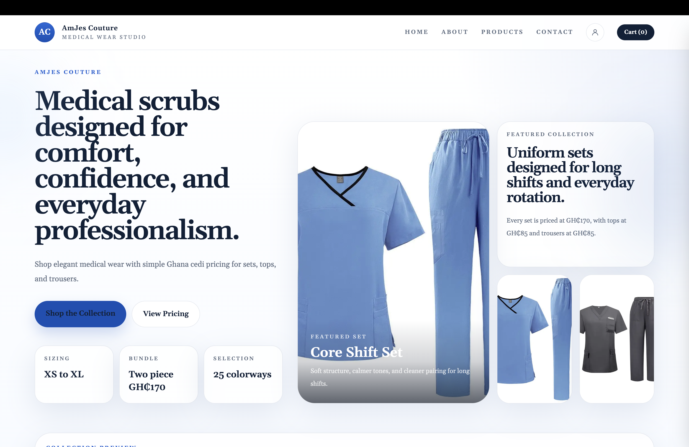
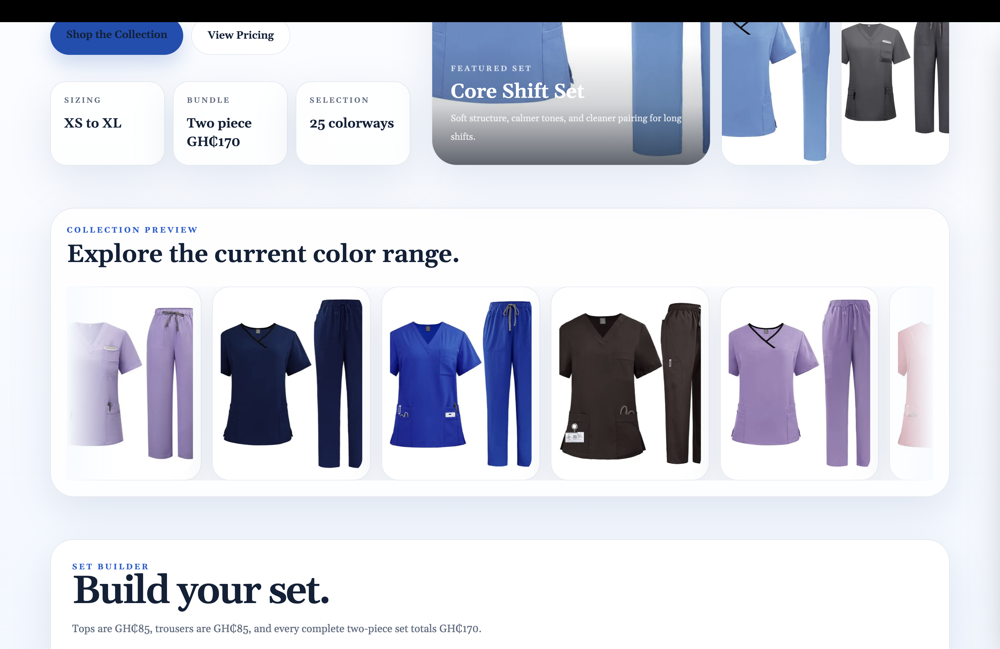
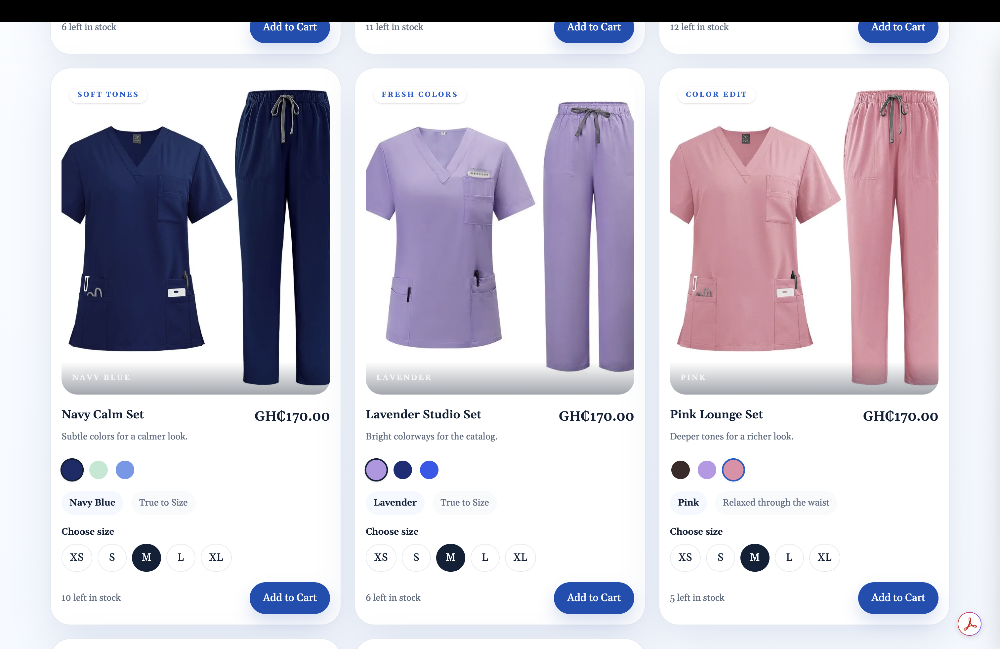
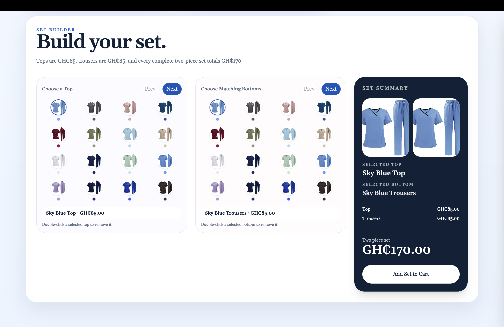
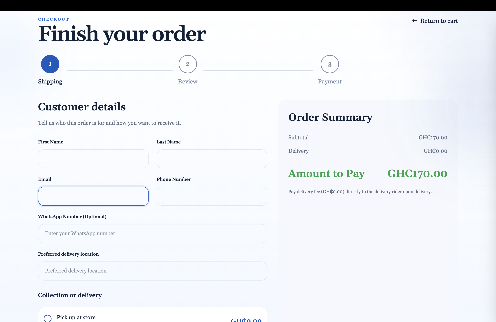
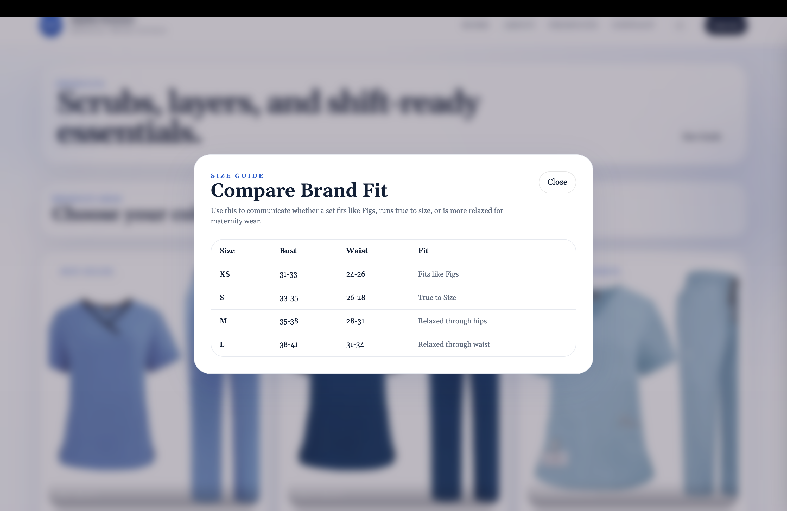
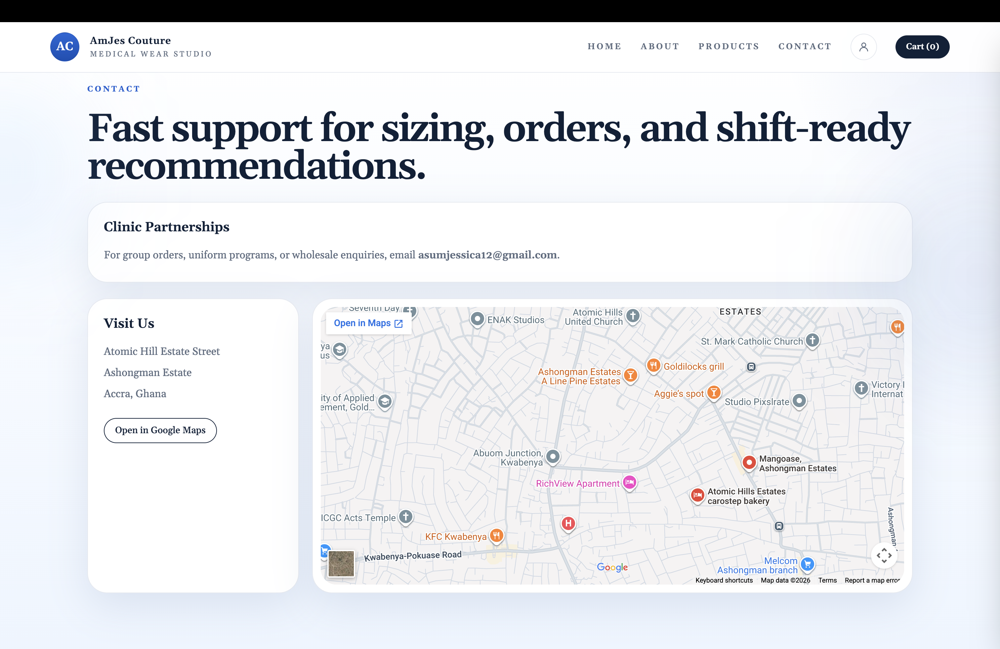

# AmJes Couture Client Commerce Case Study

Public case study for a client-facing e-commerce platform built and deployed for **AmJes Couture**, a medical wear brand.

## Overview

This project was delivered as a real business platform rather than a demo storefront. The goal was to create a polished, production-ready e-commerce experience that supports product discovery, secure checkout, customer accounts, order tracking, and day-to-day admin operations.

The live implementation was built for a client, so the production codebase remains private. This repository presents the project as a professional case study, with screenshots and a high-level breakdown of the system I designed and shipped.

## My Role

I built and deployed the platform end to end as the developer responsible for:

- Frontend implementation
- Backend integration
- Authentication and authorization
- Payment integration
- Order persistence and tracking
- Admin tooling
- Deployment and production configuration

## Solution Delivered

### Customer Experience

- Responsive storefront designed to work cleanly across mobile, tablet, and desktop devices
- Product browsing experience tailored for medical scrubs and coordinated sets
- Interactive set builder for selecting tops and bottoms
- Authentication with email/password and Google sign-in
- Three-step checkout flow
- Paystack payment processing
- Customer order history
- Order tracking with unique tracking numbers
- Transactional email updates after purchase and status changes

### Admin Experience

- Secure admin-only dashboard
- Product creation, editing, and deletion
- Price and stock management
- Product image handling
- Order management and status updates
- Customer notification triggers from admin actions

## Stack

- **Next.js 15**
- **React 19**
- **TypeScript**
- **Supabase** for auth, database, and storage
- **Paystack** for payments
- **Resend** for transactional email delivery
- **Vercel** for deployment

## Engineering Highlights

- Server-side Paystack verification before saving paid orders
- Supabase Row Level Security to protect customer order access
- Admin route and action protection based on authenticated identity
- Server-authoritative pricing to prevent checkout tampering
- Tracking-number generation for customer order lookup
- Real operational workflows for product edits, payments, order updates, and customer communication

## Screenshots

### Storefront

### Checkout

### Operations

## Outcome

The finished platform supports real business operations, not just static presentation. It gives the client a working commerce system for catalog management, secure payments, order visibility, tracking, and post-purchase follow-up from a single product.

## Note

Source code is private because this was developed as a client project.
